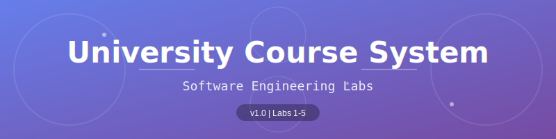
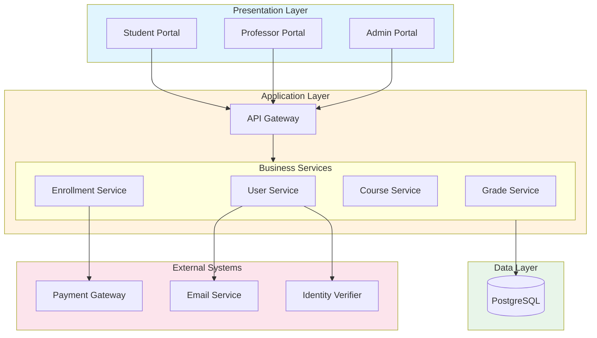
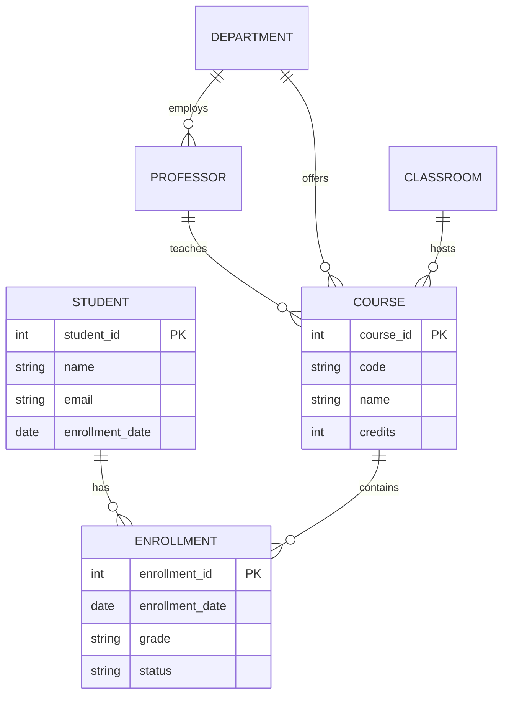
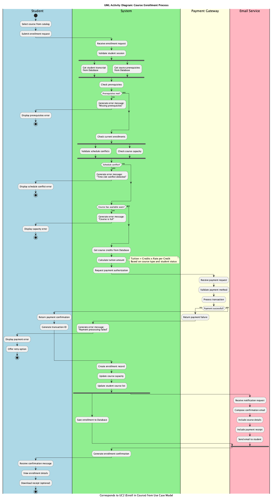
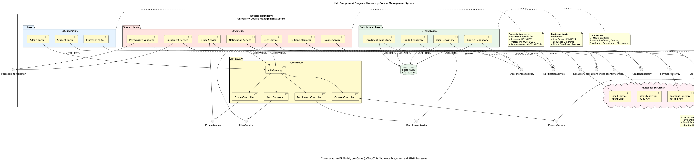

<p align="center">
  
</p>

<p align="center">
  <a href="#overview"></a>
  <a href="#tech-stack"></a>
  <a href="#tech-stack"></a>
  <a href="#"></a>
</p>

<p align="center">
  <b>Software Engineering Laboratory Works</b><br>
  Data Modeling | Requirements | Behavior | Process | Architecture
</p>

---

## Overview

A comprehensive software engineering project demonstrating the complete modeling lifecycle of a **University Course Management System** — from data models to system architecture.

```
Student Registration → Course Enrollment → Grade Management → Transcript Generation
```

---

## System Architecture



---

## Project Structure

```
Nechai_labs/
│
├── lab1/                          # Data Modeling
│   ├── diagram.puml               # ER Diagram (PlantUML)
│   ├── diagram.mmd                # ER Diagram (Mermaid)
│   ├── schema.sql                 # Database Schema
│   └── Model.java                 # Domain Models
│
├── lab2/                          # Requirements Engineering
│   ├── requirements.md            # Functional & Non-functional
│   ├── PlantUML.puml              # Use Case Diagram
│   └── traceability_matrix.md     # Requirements Traceability
│
├── lab3/                          # Behavioral Modeling
│   ├── sequence_register_student.puml
│   └── sequence_enroll_course.puml
│
├── lab4/                          # Process Modeling
│   ├── activity_enroll_course.puml    # UML Activity
│   ├── bpmn_enroll_course.puml        # BPMN 2.0
│   └── screenshots/
│
├── lab5/                          # Component Architecture
│   ├── component_diagram.puml
│   └── screenshots/
│
└── assets/
    └── header.svg
```

---

## Labs Overview

<table>
<tr>
<td width="50%">

### Lab 1: Data Modeling
**ER Diagrams & Database Schema**

- 6 Entities: Student, Professor, Course, Enrollment, Department, Classroom
- Relationships with cardinality
- SQL schema generation
- Java domain models

</td>
<td width="50%">

### Lab 2: Requirements
**Use Cases & Traceability**

- 25 Functional Requirements
- 20 Non-functional Requirements
- 21 Use Cases
- Full traceability matrix

</td>
</tr>
<tr>
<td width="50%">

### Lab 3: Behavior
**Sequence Diagrams**

- Student Registration flow
- Course Enrollment process
- Error handling scenarios
- System interactions

</td>
<td width="50%">

### Lab 4: Processes
**Activity & BPMN Diagrams**

- UML Activity Diagram
- BPMN 2.0 Diagram
- Swimlanes (4 actors)
- Parallel flows & decisions

</td>
</tr>
<tr>
<td colspan="2">

### Lab 5: Architecture
**Component Diagram**

- 4-tier architecture (UI, API, Service, Data)
- Provided/Required interfaces
- External system integrations
- System boundary definition

</td>
</tr>
</table>

---

## Key Entities



---


---

## Diagram Previews

<details>
<summary><b>Lab 1: ER Diagram (PlantUML)</b></summary>
<br>

</details>

<details>
<summary><b>Lab 1: ER Diagram (Mermaid)</b></summary>
<br>

</details>

<details>
<summary><b>Lab 2: Use Case Diagram</b></summary>
<br>

</details>

<details>
<summary><b>Lab 3: Sequence Diagram (Registration)</b></summary>
<br>

</details>

<details>
<summary><b>Lab 3: Sequence Diagram (Enrollment)</b></summary>
<br>

</details>

<details>
<summary><b>Lab 4: Activity Diagram</b></summary>
<br>

</details>

<details>
<summary><b>Lab 4: BPMN Diagram</b></summary>
<br>

</details>

<details>
<summary><b>Lab 5: Component Diagram</b></summary>
<br>

</details>

---

<p align="center">
  <sub>Built with PlantUML & Mermaid | KPI Software Engineering</sub>
</p>
